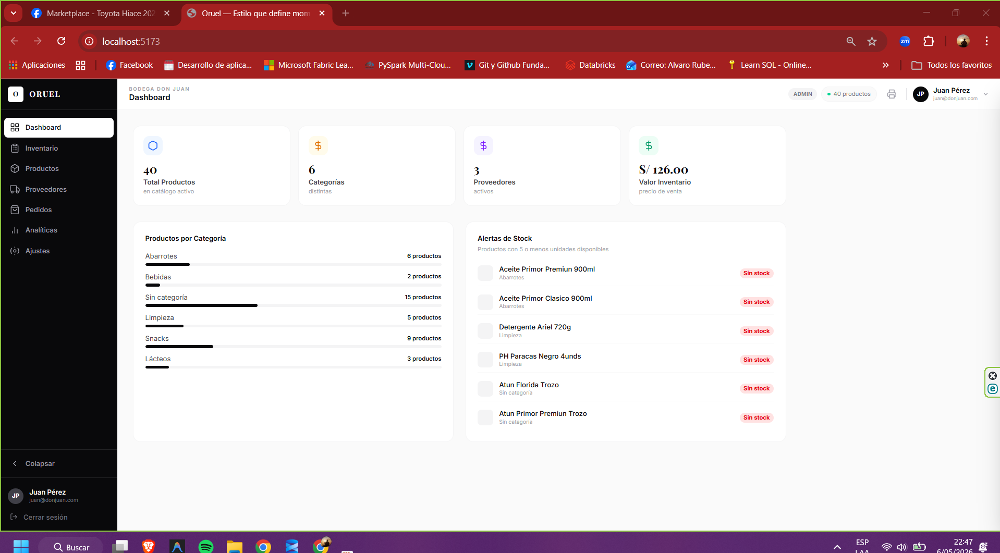
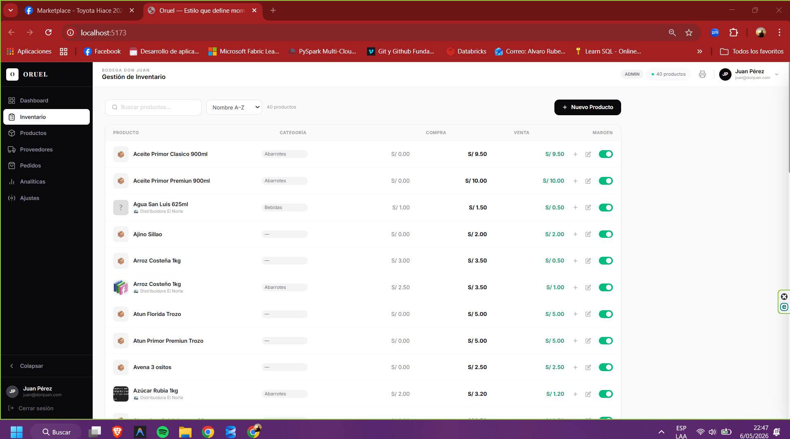
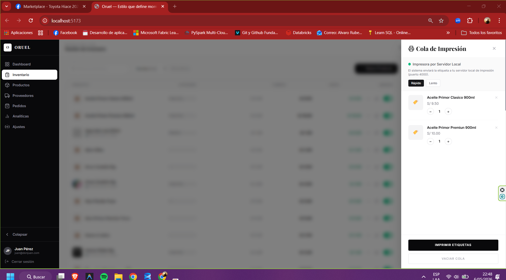
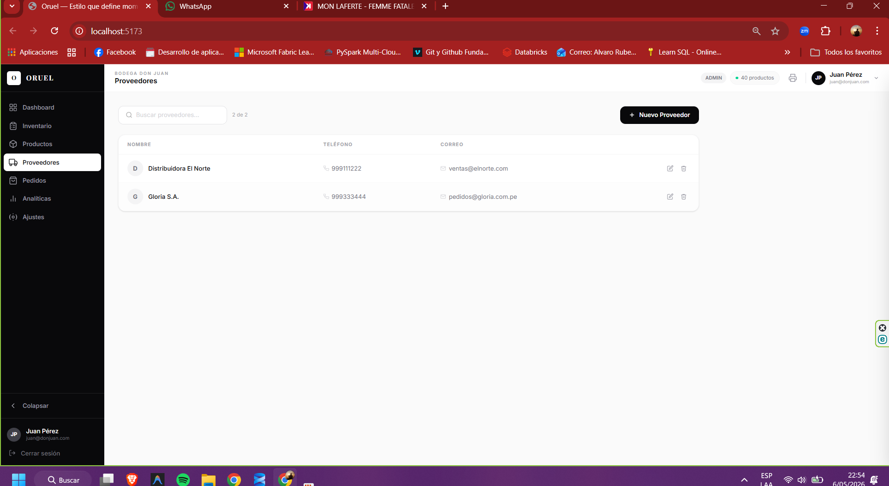

## CLONAR
```bash
git clone <url>
cd rutaCarpeta

```

## 🚀 Tecnologías usadas
- React
- TypeScript
- Vite
- TailwindCss
- Axios

## 📦 Instalación

```bash
# 1. Raíz (frontend Vite + React)
npm install
# 2. Backend Express + SQL Server
cd api
npm install
cd ..
# 3. Print server (opcional, solo si hay impresora térmica conectada)
cd print-server
npm install
cd ..
```

##  Ejecucion

```bash
# 1. Correr proyecto web
npm run dev
# 2. Correr server de la impresora si hay impresora conectada al puerto COM, por defecto puerto3 y salida puerto 4, via bluehtooh/usb
cd print server
npm start
```


##  Imagenes
# Tablero principal




)




